<p align="center">
  <picture>
    <source media="(prefers-color-scheme: dark)" srcset="docs/brand/hekato-logo-dark.webp">
    
  </picture>
</p>

<h3 align="center">One endpoint in front of every model provider.<br>Routed, metered and watched.</h3>

<p align="center">
  <a href="https://go.dev/"></a>
  <a href="#deployment"></a>
  <a href="#admin-console"></a>
  <a href="#providers"></a>
  <a href="LICENSE"></a>
</p>

<p align="center">
  <a href="#quick-start">Quick start</a> ·
  <a href="#architecture">Architecture</a> ·
  <a href="#client-api">Client API</a> ·
  <a href="#routing">Routing</a> ·
  <a href="#configuration">Configuration</a> ·
  <a href="#deployment">Deployment</a> ·
  <a href="README_CN.md">中文</a>
</p>

---

**Hekato-Go** is a self-hosted AI gateway written in Go. Your tools (Claude Code, Codex CLI, Cursor, the OpenAI and Anthropic SDKs) talk to **one** Anthropic- and OpenAI-compatible endpoint. Behind it, Hekato keeps a pool of upstream accounts across **ten providers**. It decides which account serves each request, fails over when an account breaks, enforces per-key quotas, and shows everything in a live operations console.

| | |
|---|---|
| **Speaks** | Anthropic Messages · OpenAI Chat Completions · OpenAI Responses (streaming everywhere) |
| **Routes to** | Kiro · CodeBuddy (Global & China) · Grok · Codex · Cline Pass · OpenCode Zen · OpenCode Go · Command Code · any OpenAI-compatible or Anthropic-compatible endpoint |
| **Decides with** | Weighted round-robin, conversation affinity, and an optional learning router (`model: "auto"`) |
| **Survives** | Per-account cooldowns, automatic disable/recover, warmup health checks, multi-account failover |
| **Stores in** | A single JSON file, SQLite, or PostgreSQL, with optional AES-256-GCM encryption at rest |
| **Ships as** | One static binary plus a prebuilt console (`web/`). No Node.js at runtime. |

---

## Contents

<details>
<summary><b>Expand the full table of contents</b></summary>

- [Admin console](#admin-console)
- [Quick start](#quick-start)
- [Your first request](#your-first-request)
- [Architecture](#architecture)
- [Client API](#client-api)
- [Providers](#providers)
- [Routing](#routing)
  - [Account selection](#account-selection)
  - [Conversation affinity](#conversation-affinity)
  - [Failover and account states](#failover-and-account-states)
  - [Auto routing (`model: "auto"`)](#auto-routing-model-auto)
- [Account health: warmup](#account-health-warmup)
- [API keys and quotas](#api-keys-and-quotas)
- [Thinking mode](#thinking-mode)
- [Networking: proxies and egress relays](#networking-proxies-and-egress-relays)
- [System prompt filter](#system-prompt-filter)
- [Observability](#observability)
- [Configuration](#configuration)
- [Deployment](#deployment)
- [Security checklist](#security-checklist)
- [Admin API](#admin-api)
- [Development](#development)
- [Troubleshooting](#troubleshooting)
- [Roadmap](#roadmap)
- [Credits, disclaimer and license](#credits)

</details>

---

## Admin console

The console lives at `/admin`. It is a React 19 single-page app compiled into `web/` and served by the gateway itself. It ships light and dark themes, English and Chinese, a <kbd>⌘</kbd> <kbd>K</kbd> command palette, and `g`&nbsp;+&nbsp;key jumps (`g a` opens Accounts).

<table>
  <tr>
    <td width="50%">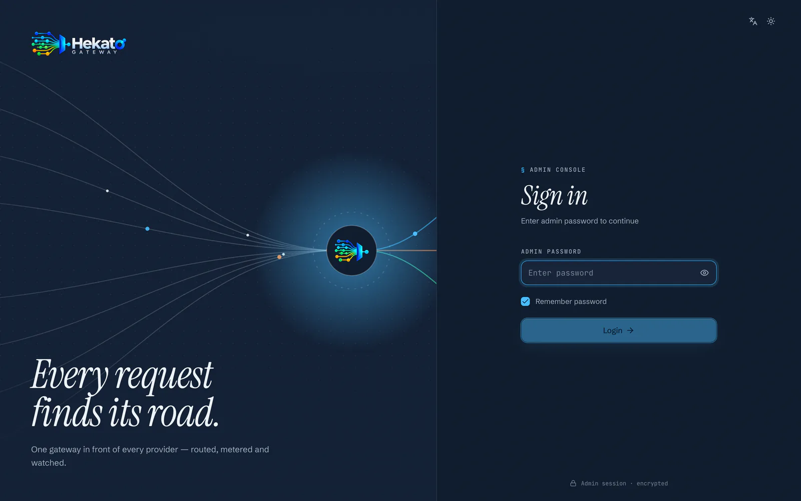<br><sub><b>Sign in.</b> On a fresh install this is a first-run setup screen. No default password ships.</sub></td>
    <td width="50%">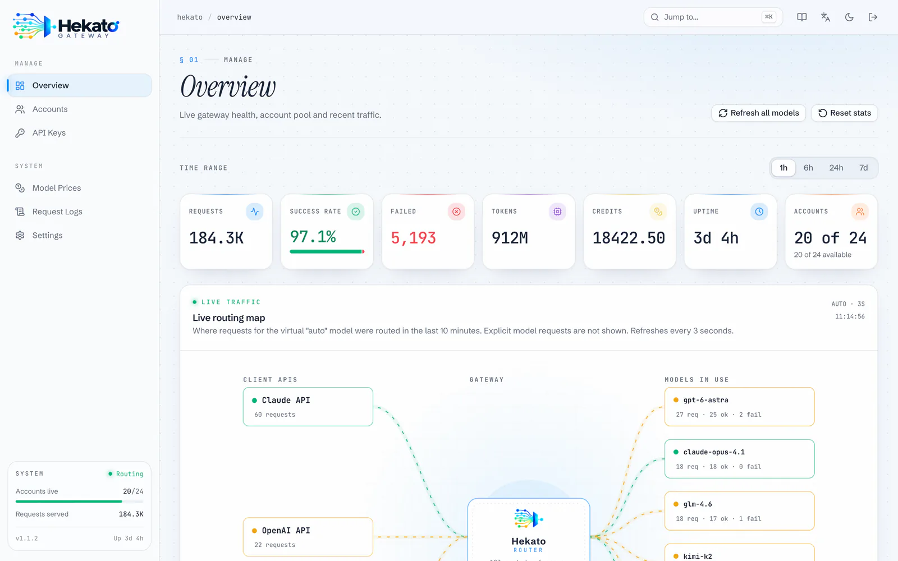<br><sub><b>Overview.</b> Lifetime readouts, pool health, a system panel, and range-scoped metrics (1h / 6h / 24h / 7d).</sub></td>
  </tr>
  <tr>
    <td>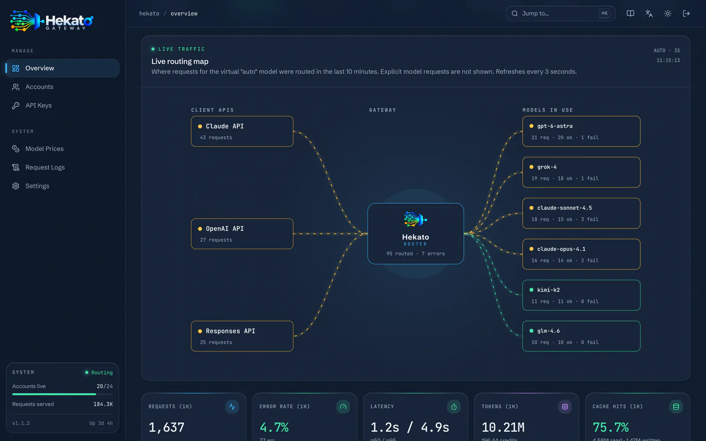<br><sub><b>Live routing map.</b> Where <code>auto</code> traffic went in the last 10 minutes, refreshed every 3 s. Traces are coloured by health.</sub></td>
    <td>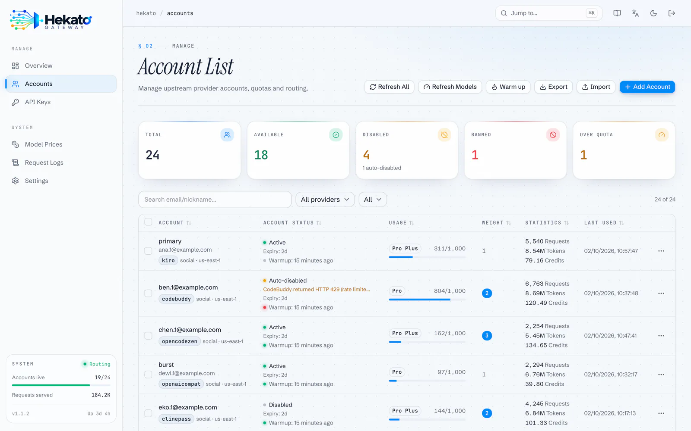<br><sub><b>Accounts.</b> Quotas, weights, warmup results, and an explicit <b>Auto-disabled</b> state with its reason. Defaults to an "Active only" view.</sub></td>
  </tr>
  <tr>
    <td>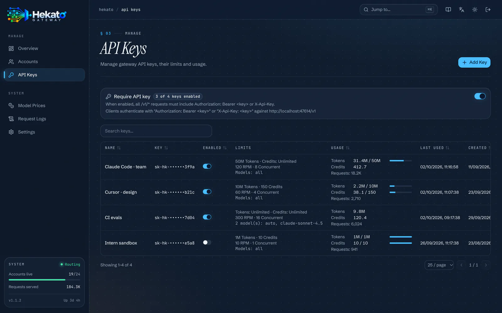<br><sub><b>API keys.</b> Token / credit / RPM / concurrency limits and model allowlists per key, with live usage bars.</sub></td>
    <td>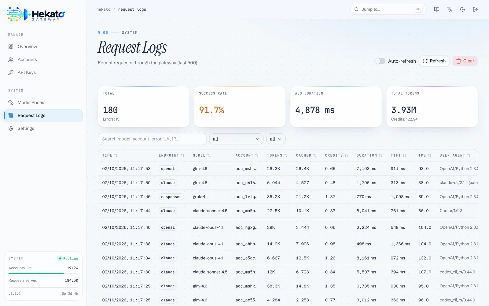<br><sub><b>Request logs.</b> The last 500 requests, with tokens, cache hits, credits, duration, TTFT, TPS and client.</sub></td>
  </tr>
  <tr>
    <td>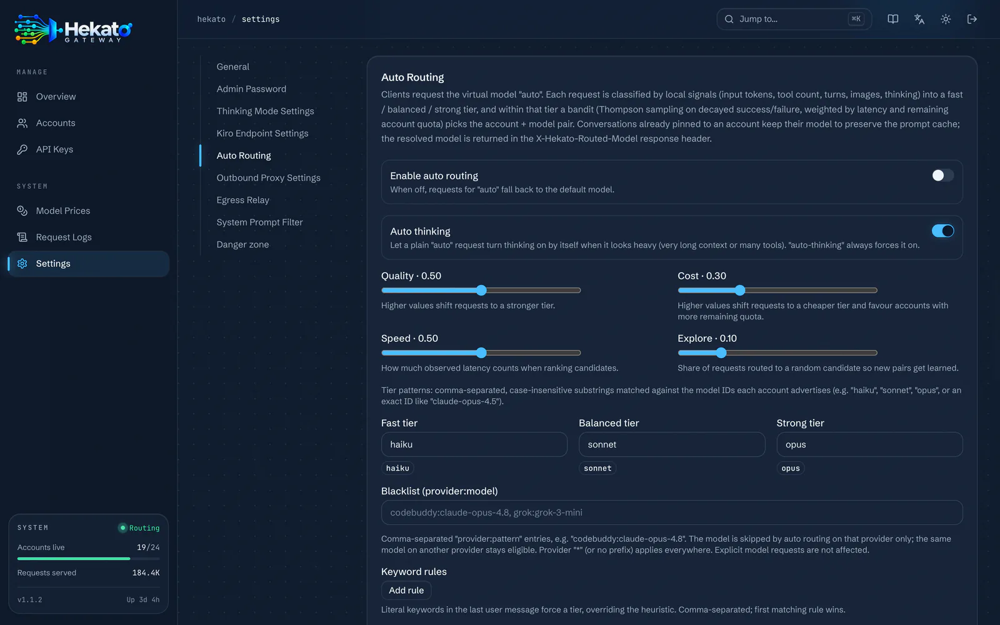<br><sub><b>Settings.</b> Every section saves on its own. The side rail follows your scroll position.</sub></td>
    <td>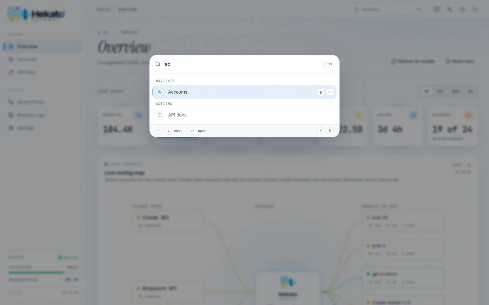<br><sub><b>Command palette.</b> Jump anywhere, flip theme or language, or sign out, without leaving the keyboard.</sub></td>
  </tr>
</table>

<sub>Screenshots use generated demo data; the accounts and addresses are fictional.</sub>

**Built for slow links.** The console is engineered for the worst connection your operators will have:

| Budget | Value | How |
|---|---|---|
| First paint | Before any JavaScript arrives | A boot splash is inlined in `index.html` |
| Login critical path | **≈ 186 KB** compressed (down from 476 KB) | Router, shell and every page are separate chunks |
| Charts | Loaded after the readouts paint | `recharts` (≈ 113 KB) is lazy |
| Repeat visits | No JavaScript re-downloaded | Hashed assets under `/admin/assets/` are served `immutable` |
| Background prefetch | Off under Save-Data or 2G | Pages are prefetched on idle otherwise |
| Theme switch | Worst visible frame ≈ 9 ms | A compositor-only curtain hides the restyle |

---

## Quick start

> **Requirements:** Docker, *or* Go **1.25+** to build from source. Node.js is only needed if you change the console.

### Docker Compose (recommended)

```bash
git clone https://github.com/billyriantono/Hekato-Go.git
cd Hekato-Go
docker compose up -d --build
```

Open **http://localhost:8080/admin**. The first visit shows a **setup screen** where you create the admin password (minimum 8 characters). Data lives in the named volume `kiro-data`, which survives rebuilds. **Never run `docker compose down -v`**: that deletes the volume.

### Docker run (prebuilt image)

```bash
docker run -d --name hekato-go \
  -p 8080:8080 \
  -v hekato-data:/app/data \
  --restart unless-stopped \
  ghcr.io/billyriantono/hekato-go:latest
```

### From source

```bash
git clone https://github.com/billyriantono/Hekato-Go.git
cd Hekato-Go
go build -o hekato-go .
./hekato-go          # reads ./data/config.json and serves ./web
```

The binary serves the console from `./web` relative to its working directory. Keep the two together.

> **Headless installs.** Set `ADMIN_PASSWORD` to skip the setup screen, for example in CI or infrastructure-as-code. The variable also overrides any stored password at boot.

---

## Your first request

Add at least one account under **Accounts → Add Account**, then:

```bash
# Anthropic Messages API
curl http://localhost:8080/v1/messages \
  -H "Content-Type: application/json" \
  -H "anthropic-version: 2023-06-01" \
  -d '{"model":"claude-sonnet-4.5","max_tokens":1024,
       "messages":[{"role":"user","content":"Hello!"}]}'

# OpenAI Chat Completions
curl http://localhost:8080/v1/chat/completions \
  -H "Content-Type: application/json" \
  -d '{"model":"claude-sonnet-4.5","stream":true,
       "messages":[{"role":"user","content":"Hello!"}]}'

# Let Hekato choose the model (requires Auto Routing to be enabled)
curl -i http://localhost:8080/v1/chat/completions \
  -H "Content-Type: application/json" \
  -d '{"model":"auto","messages":[{"role":"user","content":"Refactor this function…"}]}'
#   → X-Hekato-Routed-Model: <the model it picked>
```

Once **Require API key** is on, add `-H "Authorization: Bearer <key>"` or `-H "X-Api-Key: <key>"`.

Every gateway also serves its own documentation at **`/docs`**: endpoint reference, model naming, thinking mode, the `auto` model, limits, and setup guides for coding agents, SDKs and chat apps. Every snippet is pre-filled with that gateway's base URL.

---

## Architecture

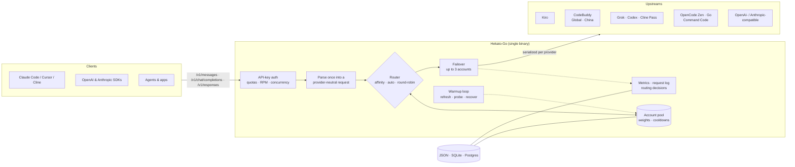

**One request, end to end:**

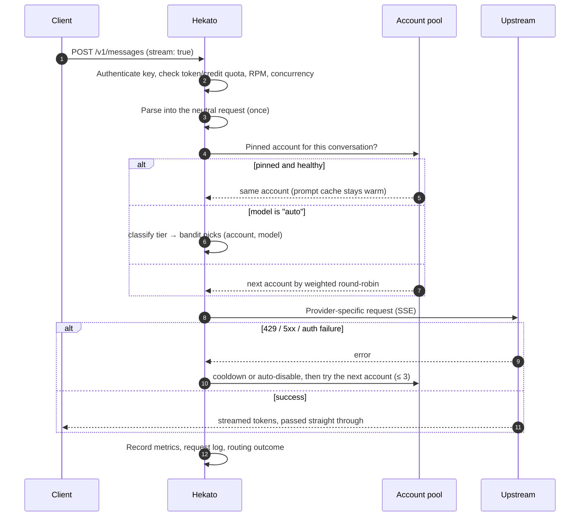

**Design rules that keep it maintainable:**
- **Parse once, serialize per provider.** Every client format becomes one neutral request. Each provider package only knows how to serialize from that form. Handlers, the pool, rate limiting, affinity, auto routing and metrics never reference a provider by name.
- **Adding an upstream** is a new `providers/<name>/` package plus a single registration file. See [Adding a provider](#adding-a-provider).
- **The console is static.** `web/` is generated by `pnpm build` and committed, so the binary has no build-time dependency on Node.js.

---

## Client API

| Method | Path | Purpose | Notes |
|---|---|---|---|
| `POST` | `/v1/messages` | Anthropic Messages API | Also `/messages` and `/anthropic/v1/messages`. SSE streaming. |
| `POST` | `/v1/messages/count_tokens` | Token count | Also `/messages/count_tokens`. |
| `POST` | `/v1/chat/completions` | OpenAI Chat Completions | Also `/chat/completions`. SSE streaming. |
| `POST` | `/v1/responses` | OpenAI Responses API | Also `/responses`. Stored responses are purged after **30 days**. |
| `GET` | `/v1/models` | Model catalogue | Also `/models`. Adds the aliases `auto`, `auto-thinking`, `gpt-4o` and `gpt-4`. Filtered to the caller key's allowlist. |
| `GET` | `/v1/usage` | Self-service quota & usage for the calling key | Authenticated by the key itself. |
| `GET` | `/v1/usage/logs` | The calling key's own request log | Authenticated by the key itself. |
| `GET` | `/v1/stats` | Pool and request counters | Requires an API key. |
| `POST` | `/v1/systemone` | Pass-through to an OpenCode Zen account (default model `jev-1.13-free`) | Also `/zen/v1/systemone`. |
| `GET` | `/health` | `{status, version, uptime}` | No auth. Use it for liveness probes. |
| `GET` | `/usage` · `/docs` | Public self-service usage page · documentation site | No auth. |
| `GET` | `/admin` | Admin console | Calls the [Admin API](#admin-api). |

**Authentication.** Send the key as `Authorization: Bearer <key>` or `X-Api-Key: <key>`. With **Require API key** off (the default on a fresh install), every request is accepted, but a valid key is still attributed so its usage is counted.

**Response headers you can rely on:**

| Header | When |
|---|---|
| `X-Hekato-Routed-Model` | `auto` requests: the concrete model that served the request |
| `X-Hekato-Route-Reason` | `auto` requests: why that candidate won (tier, signals, candidates) |
| `Retry-After: 1` | `429` caused by a key's RPM or concurrency limit |

**Errors** use the client's own dialect: Anthropic-shaped on `/v1/messages`, OpenAI-shaped on the OpenAI routes. A key over its token or credit quota gets `429`; a missing or invalid key gets `401`.

CORS is fully open (`Access-Control-Allow-Origin: *`) so browser-based tools can call the gateway directly. **Protect the API with keys, not with CORS.**

---

## Providers

Each provider is a package under `providers/` with an adapter in `proxy/provider_<name>.go`. An endpoint can only use providers that implement it. The OpenAI Responses API falls back to Chat Completions when a provider has no native implementation.

| Provider | Kind | How you add an account | Anthropic | OpenAI | Responses | Quota fetch | Models |
|---|---|---|:-:|:-:|:-:|:-:|---|
| **Kiro** (AWS) | `kiro` | AWS Builder ID · IAM Identity Center · Microsoft 365 / Entra ID SSO · SSO token · credentials JSON | ✅ | ✅ | ↩︎ | ✅ | listed live |
| **CodeBuddy** (Tencent) | `codebuddy` | API key, JWT or token JSON, many at once. **Global** (`codebuddy.ai`) or **China** (`copilot.tencent.com`), detected from the token issuer. | ✅ | ✅ | ↩︎ | ✅ | static catalogue (+ custom IDs) |
| **Grok** (xAI) | `grok` | Device-code login or token import | ✅ | ✅ | ✅ | ✅ | listed live |
| **Codex** (OpenAI / ChatGPT) | `codex` | Import an `auth.openai.com` OAuth token JSON; refreshed automatically | — | ✅ | ✅ | ✅ | listed live |
| **Cline Pass** | `clinepass` | WorkOS OAuth token JSON or a raw `clp_` key | ✅ | ✅ | ↩︎ | ✅ | pass catalogue |
| **OpenCode Zen** | `opencode_zen` | Token import; an empty token uses the free tier. Paid models need *Allow paid models*. | ✅ | ✅ | ✅ | ✅ | listed live |
| **OpenCode Go** | `opencode_go` | Token import (subscription) | ✅ | ✅ | ✅ | ✅ | listed live |
| **Command Code** | `commandcode` | API key (`user_…`) | ✅ | ✅ | ↩︎ | ✅ | static catalogue |
| **OpenAI-compatible** | `openai_compat` | Base URL + key (sent as `Bearer`) | ✅ | ✅ | ↩︎ | — | per account |
| **Anthropic-compatible** | `anthropic_compat` | Base URL + key (sent as `x-api-key`) | ✅ | ✅ | ↩︎ | — | per account |

<sub>✅ native · ↩︎ served through the Chat Completions fallback · — not supported. **Codex accounts never serve `/v1/messages`**; point Anthropic-format clients at other providers.</sub>

**Per-account model control.** Every account can add model IDs (`extraModels`) and restrict what it serves with an allowlist (`enabledModels`): unset means all models, `[]` means none, `[ids]` means only those. Newly added models join an active allowlist automatically.

---

## Routing

### Account selection

Requests for a concrete model go to the accounts that serve it, using **weighted round-robin**. An account's *weight* (1, 2, 3…) is its share of traffic. Accounts in cooldown, disabled accounts, and accounts whose allowlist excludes the model are skipped.

### Conversation affinity

Multi-turn conversations stick to the account that served them, so upstream prompt caches stay warm instead of being spread across the pool.

| Property | Value |
|---|---|
| Key | model + system prompt + the conversation's first anchor message |
| TTL | **5 minutes**, refreshed when the pin is (re)written. It is *not* extended on every hit. |
| Capacity | In memory, pruned beyond 4,096 conversations |
| Fallback | If the pinned account is cooling down or excluded, routing picks again and re-pins |

### Failover and account states

A failed attempt moves on to the next account, **up to 3 accounts per request**. Each failure is classified, and the classification decides what happens to the account:

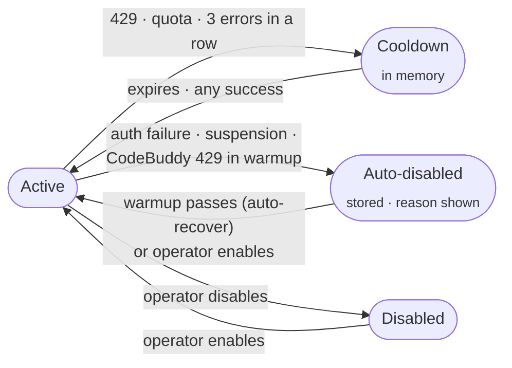

| State | Stored? | Shown in the console as | Leaves the state when |
|---|---|---|---|
| **Cooldown** | No (in memory) | still *Active* | the cooldown expires or a request succeeds |
| **Auto-disabled** | Yes (`banStatus`, `banReason`) | **Auto-disabled** + reason | a warmup passes (if *Auto-recover* is on), or an operator re-enables it |
| **Disabled** | Yes | Disabled | an operator re-enables it |

Overage errors (`402` + "overage") switch off the account's *overage* capability. The account itself stays enabled. Turning an account on or off yourself always clears the auto-disable marker, so a manual decision is never undone by auto-recover.

### Auto routing (`model: "auto"`)

Enable it under **Settings → Auto Routing**, then send `"model": "auto"`. Routing happens in two layers:

1. **Tier.** Local signals classify the request as `fast`, `balanced` or `strong`. The signals are input tokens, tool count, turns, images, requested thinking, and what the last user message looks like: code, reasoning cues, or a one-word acknowledgement. Literal **keyword rules** override the heuristic. The *Quality* and *Cost* sliders shift the tier up or down.
2. **Candidate.** Within the tier, every (account, model) pair in the pool is a candidate. A **Thompson-sampling bandit** scores each one on decayed success/failure, weights it by observed latency (*Speed*) and remaining quota (*Cost*), and picks the best. *Explore* adds random exploration, which fades as evidence accumulates.

| Setting | Default | Meaning |
|---|---|---|
| `enabled` | `false` | When off, `auto` is passed to the upstream unchanged |
| `qualityWeight` / `costWeight` | `0.5` / `0.3` | A difference of at least 0.5 moves the tier one step |
| `speedWeight` | `0.5` | How much observed latency counts |
| `explore` | `0.1` | Share of traffic routed to a random candidate while evidence is thin |
| Tiers `fast` / `balanced` / `strong` | `haiku` / `sonnet` / `opus` | Case-insensitive substrings or exact model IDs |
| `blacklist` | — | `provider:pattern` entries; `*` applies to every provider |
| `keywordRules` | — | `{keywords, tier}`: the first match wins over the heuristic |
| `autoThinking` | `true` | A heavy `auto` request may turn on thinking; `auto-thinking` always does |

Bandit internals: success/failure statistics decay with a **24 h half-life**, a pair the upstream keeps rejecting is **quarantined for 30 minutes**, and the last **200 decisions** (with the signals that drove them) are kept for the console. The routed model and the reason come back in `X-Hekato-Routed-Model` and `X-Hekato-Route-Reason`.

---

## Account health: warmup

On every account refresh cycle (default **every 30 minutes**; *Settings → General*, or `ACCOUNT_REFRESH_MINUTES`) the gateway warms up the pool, **5 accounts at a time**:

| Step | What happens | Retries |
|---|---|---|
| 1. Token | Refresh credentials that are about to expire | 2 retries, transient errors only (5xx, network) |
| 2. Quota | Re-fetch usage, credits and subscription | same |
| 3. Probe *(opt-in)* | Send a tiny `Say OK` chat to prove inference works | same |
| 4. Recover *(opt-in)* | Re-enable an **auto-disabled** account that passed every step | — |

The outcome (status, error, time) is shown per account. You can also trigger a run from the Accounts page, for all accounts or a selection, or with `POST /admin/api/warmup`. A failed warmup on an enabled account goes through the same failover classification as live traffic. One addition: **a CodeBuddy account (Global or China) answered with a typed HTTP 429 is auto-disabled as `RATE_LIMITED`**, so it stops failing silently and is recovered once a later warmup passes.

---

## API keys and quotas

Issue as many gateway keys as you need under **API Keys**. Each key carries:

| Field | Meaning (`0` = unlimited) |
|---|---|
| `tokenLimit` / `creditLimit` | Lifetime token / credit quota. Over quota → `429`. |
| `rpmLimit` | Requests per rolling minute. Over the limit → `429` + `Retry-After: 1`. |
| `concurrencyLimit` | Maximum requests in flight. Over the limit → `429` + `Retry-After: 1`. |
| `allowedModels` | Case-insensitive allowlist. `*` is a prefix wildcard; include `auto` to allow the virtual model. |

Usage counters never reset by themselves. Reset a key from the console or with `POST /admin/api/api-keys/{id}/reset-usage`. Key holders can check their own standing without admin access at **`/usage`** (which calls `GET /v1/usage`). Rate-limit windows are kept in memory, so they restart with the process.

---

## Thinking mode

- **By model name:** append the suffix (default `-thinking`), e.g. `claude-sonnet-4.5-thinking` or `auto-thinking`.
- **By request (Anthropic format):** send a top-level `thinking` object:
  - `{"type":"enabled","budget_tokens":2048}`: `budget_tokens` must be **≥ 1024** and **below `max_tokens`**
  - `{"type":"adaptive"}` or `{"type":"disabled"}`: no budget allowed
- **Output shape:** choose how thinking is returned to OpenAI and Claude clients (`reasoning_content`, `thinking` or `think`) under *Settings → Thinking Mode*.

---

## Networking: proxies and egress relays

| Feature | What it does |
|---|---|
| **Outbound proxy** | Send upstream traffic through an `http://` or `socks5://` proxy. Takes effect without a restart. |
| **Proxy pool** | Several proxies. Each account is pinned to one by hashing its ID, so it keeps a stable egress IP. |
| **Egress relay** | Forward upstream calls through a relay you control. Requests carry `X-Relay-Target` and `X-Relay-Key`. |
| **Per-account override** | Any account can set its own proxy, relay URL or relay secret. |

Ready-to-deploy relay sources are embedded in the binary and can be downloaded from *Settings → Egress Relay* with your secret already filled in. Targets: **Cloudflare Workers** (`worker.js`), **Vercel Edge** (`api/relay.js`) and **Deno Deploy** (`main.ts`).

Kiro accounts can also pin an endpoint family (`auto`, `kiro`, `codewhisperer`, `amazonq`), with fallback on by default.

---

## System prompt filter

Rewrite system prompts before they leave the gateway. There are built-in toggles that strip Claude Code boilerplate (`filterClaudeCode`), environment noise (`filterEnvNoise`) and boundary markers (`filterStripBoundaries`). You can also add your own rules, each of type `regex` or `lines-containing`, that you can name, enable and disable individually.

---

## Observability

| Signal | Retention | Where |
|---|---|---|
| **Per-minute metrics**: requests, errors, tokens, credits, cache reads/writes, latency histogram, per-model / per-account / per-endpoint counters | **7 days**, flushed every 30 s and on SIGINT/SIGTERM | Overview (1h · 6h · 24h · 7d); persisted in `metrics_minutes` (SQL) or `metrics.json` |
| **Request log**: model, account, tokens, cache, credits, duration, TTFT, TPS, user agent, client IP | **500** in memory, written to disk every 5 s | Request Logs; persisted in `request_logs.json` or SQL |
| **Routing decisions**: tier, signals, candidates, score, exploration | last **200** | Overview → Auto routing card |
| **Model prices**: synced from [models.dev](https://models.dev) | every 12 h by default; survives restarts | Model Prices |
| **Health** | live | `GET /health`; the console's system panel |

---

## Configuration

### Environment variables

| Variable | Default | Purpose |
|---|---|---|
| `CONFIG_PATH` | `data/config.json` | Config file. Its directory is the data directory, and it seeds the first SQL migration. |
| `ADMIN_PASSWORD` | — | Sets or overrides the admin password at boot and skips the setup screen. |
| `DB_DRIVER` | `json` | `json`/`file`, `sqlite`/`sqlite3`, or `postgres`/`postgresql`/`pgx`. |
| `DATABASE_URL` | SQLite: `kiro.db` beside `CONFIG_PATH` | SQLite path or a Postgres URL (required for Postgres). Without `DB_DRIVER`, a `postgres://` URL selects Postgres. |
| `ENCRYPTION_KEY` | — | Encrypts stored secrets with AES-256-GCM (see the [security checklist](#security-checklist)). |
| `LOG_LEVEL` | `info` | `debug`, `info`, `warn` or `error`. Wins over the config file. |
| `ACCOUNT_REFRESH_MINUTES` | `30` | Warmup cadence. The value set in the console takes precedence. |
| `KIRO_SSO_CALLBACK_BIND` | loopback | Bind host for the Microsoft SSO callback on port **3128**. Use `0.0.0.0` in Docker. |
| `KIRO_PROFILE_REGIONS` | `us-east-1,eu-central-1` | Fallback regions for Kiro profile lookup. |

### Console settings

<details>
<summary><b>Every section of <i>Settings</i>, and the config fields behind it</b></summary>

| Section | Fields |
|---|---|
| **General** | `logLevel` · `accountRefreshMinutes` (0–1440, 0 = default) · `modelsDevSyncHours` (0 = 12 h, negative = off) · `testModel` · `warmupProbe` · `warmupRecover` · `customModelIds` · `allowOverUsage` · `requireApiKey` |
| **Admin password** | `password` (minimum 8 characters) |
| **Thinking mode** | `thinkingSuffix` (`-thinking`) · `openaiThinkingFormat` · `claudeThinkingFormat` |
| **Kiro endpoint** | `preferredEndpoint` (`auto`·`kiro`·`codewhisperer`·`amazonq`) · `endpointFallback` (`true`) |
| **Auto routing** | see [Auto routing](#auto-routing-model-auto) |
| **Outbound proxy** | `proxyURL` · `proxyPool` · `useRelay` |
| **Egress relay** | `relayEnabled` · `relayURL` · `relaySecret` |
| **System prompt filter** | `filterClaudeCode` · `filterEnvNoise` · `filterStripBoundaries` · `promptFilterRules` |
| **Danger zone** | reset statistics · clear request logs |

Defaults on a fresh install: listen on `0.0.0.0:8080`, `requireApiKey: false`, no admin password (setup required).

</details>

### Storage backends

| Backend | Select with | Notes |
|---|---|---|
| **JSON file** *(default)* | nothing | One file at `CONFIG_PATH`, written atomically |
| **SQLite** | `DB_DRIVER=sqlite` | Pure Go (no CGO). Defaults to `kiro.db` beside the config. |
| **PostgreSQL** | `DB_DRIVER=postgres` + `DATABASE_URL=postgres://…` | Use it for managed databases or when several operators need it |

The first time a SQL backend starts, an existing `config.json` is **migrated automatically**: accounts, keys and settings all carry over.

---

## Deployment

### Container image

Every push to `main`, `master` or `dev`, and every `v*` tag, builds a multi-arch image:

```
ghcr.io/billyriantono/hekato-go:<tag>     # linux/amd64 · linux/arm64
```

Tags: `latest` (default branch only), the branch name, `{{version}}` / `{{major}}.{{minor}}` for releases, and the short SHA. The image exposes **8080** (API + console) and **3128** (Microsoft SSO callback). It deliberately declares **no `VOLUME`**; mount `/app/data` yourself.

### Bare metal: systemd + reverse proxy

This is the layout the reference deployment uses, hardened by systemd and behind Caddy for TLS and compression:

```ini
# /etc/systemd/system/hekato-go.service
[Unit]
Description=Hekato-Go AI Gateway
After=network-online.target
Wants=network-online.target

[Service]
User=hekato
Group=hekato
WorkingDirectory=/opt/hekato-go          # must contain web/
EnvironmentFile=/etc/hekato-go.env       # CONFIG_PATH, ENCRYPTION_KEY, …
ExecStart=/opt/hekato-go/hekato-go
Restart=always
RestartSec=3
NoNewPrivileges=true
ProtectSystem=strict
ReadWritePaths=/opt/hekato-go/data
PrivateTmp=true
LimitNOFILE=65536

[Install]
WantedBy=multi-user.target
```

```caddyfile
gateway.example.com {
    encode zstd gzip
    reverse_proxy 127.0.0.1:8080 {
        flush_interval -1          # stream tokens as they arrive (SSE)
        transport http {
            read_timeout 0         # reasoning models can think for minutes
            write_timeout 0
        }
    }
}
```

> **Behind any reverse proxy, turn response buffering off** (`flush_interval -1` in Caddy, `proxy_buffering off` in nginx). Otherwise streamed answers arrive in one burst at the end.

**Upgrades and rollback.**
- **Binary release:** back up the binary as `hekato-go.previous-<timestamp>`, replace it, then run `systemctl restart hekato-go`.
- **Console-only release:** no restart is needed, because the gateway reads `web/` from disk on every request. Extract the new console beside the old one and swap the directories with `mv web web.previous-<ts> && mv web.new web`.
- **Rollback:** reverse the rename (and restart, for the binary).

### Zeabur

The repository's `Dockerfile` builds on Zeabur unchanged. Create a service with *Deploy from GitHub*, expose port **8080**, and mount a volume at **`/app/data`**. With the CLI, run `zeabur deploy` from the repository root, and don't commit the generated `.zeabur/context.json`.

---

## Security checklist

- [ ] **Admin password set.** A fresh install refuses admin calls until setup is complete. Comparison is constant-time.
- [ ] **`ENCRYPTION_KEY` set** before you add accounts. It encrypts the admin password, relay secrets, every account's access/refresh tokens, client secrets and compatible-provider keys, and every gateway API key. **Back the key up: without it the config cannot be read.**
- [ ] **Require API key on**, with a separate key per tool or team, each with RPM and concurrency limits.
- [ ] **TLS in front.** Admin requests carry the password in `X-Admin-Password` (or the console's session); never expose them over plain HTTP.
- [ ] **Port 3128 stays local.** Publish it only on `127.0.0.1`, and only while a Microsoft SSO login is in progress.
- [ ] **Remember that CORS is open** (`*`): API keys are the protection boundary.

---

## Admin API

Everything the console does goes through `/admin/api/*`. Authenticate with `X-Admin-Password: <password>`. Before setup, only `GET /setup/status` and `POST /setup` are available.

<details>
<summary><b>Endpoint reference</b></summary>

| Area | Endpoints |
|---|---|
| Accounts | `GET` · `POST /accounts` · `POST /accounts/batch` · `GET /accounts/{id}/full` · `PUT` · `DELETE /accounts/{id}` · `POST /accounts/{id}/refresh` · `POST /accounts/{id}/test` · `GET /accounts/{id}/models` · `GET /accounts/{id}/models/cached` · `POST /accounts/{id}/models/refresh` · `POST /accounts/models/refresh` · `GET`/`POST /accounts/{id}/overage` |
| Onboarding | `POST /auth/credentials` (generic import) and per provider: `/auth/builderid/*`, `/auth/iam-sso/*`, `/auth/kiro-sso/*`, `/auth/sso-token`, `/auth/codebuddy`, `/auth/grok/*`, `/auth/codex/import`, `/auth/clinepass/import`, `/auth/opencodezen/import`, `/auth/opencodego/import`, `/auth/commandcode/import` |
| API keys | `GET` · `POST /api-keys` · `GET` · `PUT` · `DELETE /api-keys/{id}` · `POST /api-keys/{id}/reset-usage` |
| Health & data | `GET /status` · `GET /stats` · `POST /stats/reset` · `GET` · `DELETE /logs` · `GET /metrics` · `GET /version` · `POST /export` · `GET /models-dev` |
| Warmup | `GET /warmup/status` · `POST /warmup` (`{"ids":[…]}` or all) |
| Settings | `GET`/`POST` on `/settings`, `/thinking`, `/endpoint`, `/proxy`, `/relay`, `/auto-route`, `/prompt-filter` · `POST /relay/test` · `GET /relay/source?platform=cloudflare\|vercel\|deno` · `GET /auto-route/decisions` |

</details>

---

## Development

### Repository layout

| Path | Responsibility |
|---|---|
| `main.go` | Boot: config, storage, logger, HTTP server |
| `proxy/` | HTTP surface, format translators, router, auto-router, failover, warmup, metrics, provider adapters |
| `providers/` | Neutral request model + one package per upstream, plus the `modelsdev` catalogue |
| `pool/` | Account pool: weighted round-robin, cooldowns, model lists |
| `auth/` | Login and refresh flows (Builder ID, IAM SSO, Microsoft SSO, Grok device code, Codex, Cline Pass, CodeBuddy) |
| `config/` | Config model, JSON/SQLite/Postgres stores, encryption, API keys, metric and log stores |
| `egress/` · `relay/` | Relay transport · embedded Cloudflare / Vercel / Deno relay sources |
| `logger/` | Levelled logging |
| `dashboard/` | Console source (React 19 · Vite 8 · Tailwind 4 · TanStack Router/Query/Table · Base UI) |
| `web/` | **Generated** console bundle; do not edit by hand |
| `docs/` | Screenshots and brand assets for this README |

### Build and test

```bash
go build ./...           # gateway
go test ./...            # 72 test files across proxy, config, pool, auth, providers…
go vet ./...
```

```bash
cd dashboard
pnpm install
pnpm dev                 # console on :5173; proxies /admin/api/ and /health to :8080
pnpm build               # type-check, then regenerate ../web from scratch
pnpm lint                # oxlint
```

### Adding a provider

1. Create `providers/<name>/` with the transport (`Call`), a `FromNeutral` serializer from `providers.NeutralChat`, model listing, usage fetch, and admin onboarding routes registered with `providers.RegisterAdminRoutes` in `init()`.
2. Add the provider kind and its account classification in `config/provider.go`.
3. Add `proxy/provider_<name>.go` calling `registerAdapter` with `chatFromClaude`, `chatFromOpenAI`, optionally `responses`, plus `listModels` and `fetchUsage`.
4. Add the onboarding form in `dashboard/src/pages/accounts/add-account-dialog.tsx`.

Nothing else changes. The handlers, pool, limits, affinity, auto router and metrics are provider-agnostic.

---

## Troubleshooting

<details>
<summary><b>The admin API answers <code>401 "Setup required"</code></b></summary>

No admin password exists yet. Open `/admin` and complete the setup screen, or start the gateway with `ADMIN_PASSWORD` set.
</details>

<details>
<summary><b>Clients get <code>401</code> after I enabled "Require API key"</b></summary>

Send the key as `Authorization: Bearer <key>` or `X-Api-Key: <key>`, and check that the key is **enabled**.
</details>

<details>
<summary><b>Clients get <code>429</code></b></summary>

With `Retry-After: 1`, the key hit its **RPM** or **concurrency** limit. Without it, the key is over its **token or credit quota**: raise the limit or reset usage. A `429` that comes from an *upstream* puts that account in cooldown and fails over; your client does not see it unless every candidate account failed.
</details>

<details>
<summary><b>Streaming answers arrive all at once</b></summary>

A proxy in front of Hekato is buffering. Use `flush_interval -1` (Caddy) or `proxy_buffering off` (nginx), and remove read timeouts for long-thinking models.
</details>

<details>
<summary><b>An account shows <i>Auto-disabled</i></b></summary>

The gateway disabled it itself. The reason is shown under the status: an auth failure, a suspension, or a CodeBuddy `429` during warmup. Turn on **Settings → General → Auto-recover** to have warmup re-enable it once it passes, or re-enable it yourself; doing so clears the ban marker.
</details>

<details>
<summary><b>My Codex account is never used by Claude Code</b></summary>

Codex accounts serve OpenAI Chat Completions and Responses only. Anthropic-format clients (`/v1/messages`) are routed to other providers.
</details>

<details>
<summary><b>Microsoft SSO login hangs in Docker</b></summary>

The browser redirects to `localhost:3128`. Publish the port on loopback (`127.0.0.1:3128:3128`), set `KIRO_SSO_CALLBACK_BIND=0.0.0.0`, and complete the login in a browser on the Docker host.
</details>

<details>
<summary><b>I lost <code>ENCRYPTION_KEY</code></b></summary>

The encrypted secrets cannot be recovered. Restore the key from your backup, or start a fresh data directory and re-add the accounts.
</details>

---

## Roadmap

| Status | Item |
|---|---|
| 🧪 Proposed | **LLM tier classifier for `auto`**: a configurable small model answers the bounded question *fast / balanced / strong*, while the bandit keeps choosing the account. Planned to ship in shadow mode (logged beside the heuristic), with a hard timeout that falls back to today's classifier. |
| ⏳ Waiting on upstream | **OpenAI Decisions API backend** for that classifier, once OpenAI publishes its official contract (it is in limited preview, without public documentation). |

---

## Credits

Hekato-Go began as an enhanced fork of [Quorinex/Kiro-Go](https://github.com/Quorinex/Kiro-Go) and is maintained independently at [billyriantono/Hekato-Go](https://github.com/billyriantono/Hekato-Go). The Enterprise SSO / Azure AD support builds on code and ideas from [Quorinex/Kiro-Go PR #131](https://github.com/Quorinex/Kiro-Go/pull/131). Thank you to the original maintainers, the PR author and everyone in that discussion. Friends: [LINUX DO](https://linux.do).

If Hekato saves you time, a ⭐ helps others find it.

## Disclaimer

For educational and research purposes only. Hekato-Go is not affiliated with Amazon, AWS, Kiro, Tencent, CodeBuddy, xAI, OpenAI, Cline or any other provider named here. You are responsible for complying with each provider's terms of service and with applicable law. Use at your own risk.

## License

[MIT](LICENSE)
