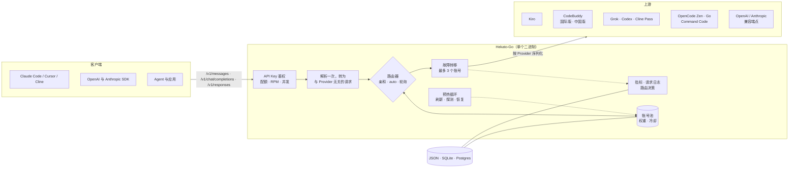
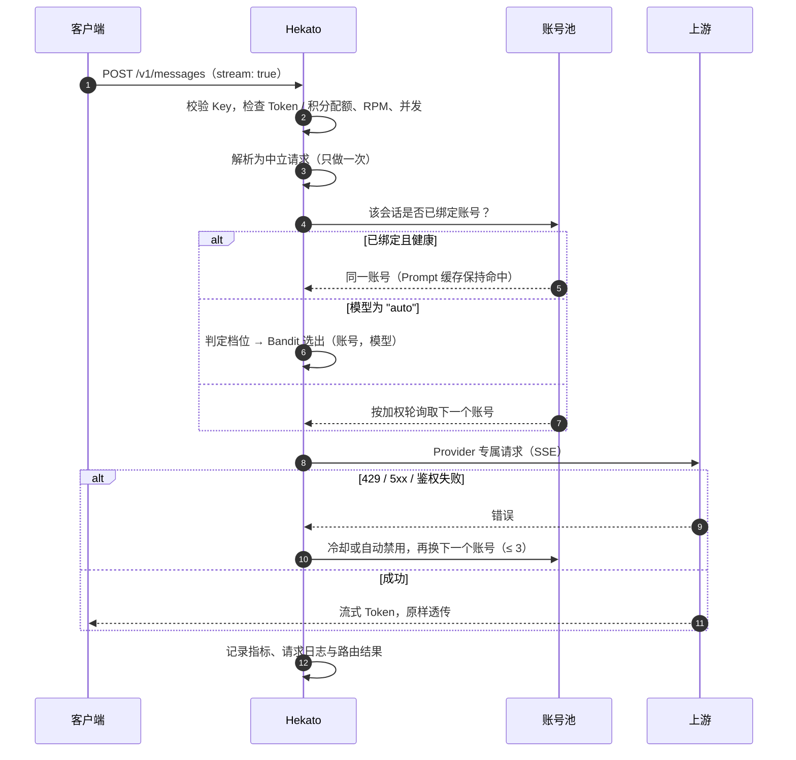
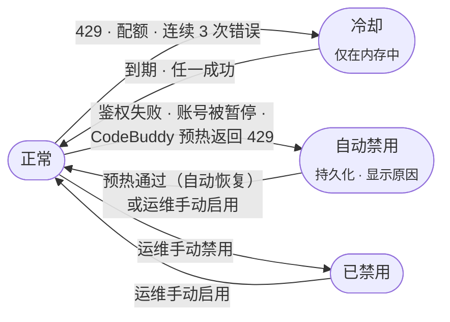

<p align="center">
  <picture>
    <source media="(prefers-color-scheme: dark)" srcset="docs/brand/hekato-logo-dark.webp">
    
  </picture>
</p>

<h3 align="center">一个入口，接入所有模型 Provider。<br>路由、计量、全程可观测。</h3>

<p align="center">
  <a href="https://go.dev/"></a>
  <a href="#部署"></a>
  <a href="#管理控制台"></a>
  <a href="#provider-一览"></a>
  <a href="LICENSE"></a>
</p>

<p align="center">
  <a href="#快速开始">快速开始</a> ·
  <a href="#架构">架构</a> ·
  <a href="#客户端-api">客户端 API</a> ·
  <a href="#路由">路由</a> ·
  <a href="#配置">配置</a> ·
  <a href="#部署">部署</a> ·
  <a href="README.md">English</a>
</p>

---

**Hekato-Go** 是一个用 Go 编写、可自托管的 AI 网关。Claude Code、Codex CLI、Cursor，以及 OpenAI / Anthropic SDK 等工具，都只需对接**一个**同时兼容 Anthropic 与 OpenAI 的入口。在它背后，Hekato 维护着一个横跨**十个 Provider** 的上游账号池：每个请求由哪个账号处理、账号出错时如何故障转移、每个 Key 的配额如何限制，都由它来决定，并在实时运维控制台中一览无余。

| | |
|---|---|
| **对外协议** | Anthropic Messages · OpenAI Chat Completions · OpenAI Responses（全部支持流式） |
| **上游** | Kiro · CodeBuddy（国际版与中国版）· Grok · Codex · Cline Pass · OpenCode Zen · OpenCode Go · Command Code · 任意 OpenAI 兼容或 Anthropic 兼容端点 |
| **决策方式** | 加权轮询、会话亲和，以及可选的自学习路由（`model: "auto"`） |
| **容错** | 按账号冷却、自动禁用 / 自动恢复、预热健康检查、多账号故障转移 |
| **存储** | 单个 JSON 文件、SQLite 或 PostgreSQL，可选 AES-256-GCM 静态加密 |
| **交付形态** | 一个静态二进制文件 + 预构建的控制台（`web/`），运行时无需 Node.js |

---

## 目录

<details>
<summary><b>展开完整目录</b></summary>

- [管理控制台](#管理控制台)
- [快速开始](#快速开始)
- [第一个请求](#第一个请求)
- [架构](#架构)
- [客户端 API](#客户端-api)
- [Provider 一览](#provider-一览)
- [路由](#路由)
  - [账号选择](#账号选择)
  - [会话亲和](#会话亲和)
  - [故障转移与账号状态](#故障转移与账号状态)
  - [自动路由（`model: "auto"`）](#自动路由model-auto)
- [账号健康：预热](#账号健康预热)
- [API 密钥与配额](#api-密钥与配额)
- [Thinking 模式](#thinking-模式)
- [网络：代理与出站中继](#网络代理与出站中继)
- [System Prompt 过滤](#system-prompt-过滤)
- [可观测性](#可观测性)
- [配置](#配置)
- [部署](#部署)
- [安全检查清单](#安全检查清单)
- [管理 API](#管理-api)
- [开发](#开发)
- [故障排查](#故障排查)
- [路线图](#路线图)
- [致谢、免责声明与许可证](#致谢)

</details>

---

## 管理控制台

控制台位于 `/admin`。它是一个 React 19 单页应用，编译到 `web/` 后由网关自身提供服务。支持浅色与深色主题、中英双语、<kbd>⌘</kbd> <kbd>K</kbd> 命令面板，以及 `g`&nbsp;+&nbsp;按键的快速跳转（`g a` 打开账号页）。

<table>
  <tr>
    <td width="50%"><br><sub><b>登录。</b>全新安装时显示首次设置页面，不预置任何默认密码。</sub></td>
    <td width="50%"><br><sub><b>概览。</b>累计读数、账号池健康度、系统面板，以及按时间范围统计的指标（1h / 6h / 24h / 7d）。</sub></td>
  </tr>
  <tr>
    <td><br><sub><b>实时路由图。</b>最近 10 分钟内 <code>auto</code> 流量的去向，每 3 秒刷新，连线按健康度着色。</sub></td>
    <td><br><sub><b>账号。</b>配额、权重、预热结果，以及带原因说明的<b>自动禁用</b>状态。默认显示"仅可用"视图。</sub></td>
  </tr>
  <tr>
    <td><br><sub><b>API 密钥。</b>每个 Key 可设置 Token / 积分 / RPM / 并发上限与模型白名单，用量实时显示。</sub></td>
    <td><br><sub><b>请求日志。</b>最近 500 条请求，含 Token、缓存命中、积分、耗时、TTFT、TPS 与客户端信息。</sub></td>
  </tr>
  <tr>
    <td><br><sub><b>设置。</b>每个分区独立保存，侧边导航跟随滚动位置高亮。</sub></td>
    <td><br><sub><b>命令面板。</b>跳转任意页面、切换主题或语言、退出登录，全程无需离开键盘。</sub></td>
  </tr>
</table>

<sub>截图使用生成的演示数据，其中的账号与地址均为虚构。</sub>

**为弱网而生。** 控制台按照运维人员可能遇到的最差网络来设计：

| 指标 | 数值 | 实现方式 |
|---|---|---|
| 首次绘制 | 任何 JavaScript 到达之前 | 启动画面直接内联在 `index.html` 中 |
| 登录关键路径 | **≈ 186 KB**（压缩后，原为 476 KB） | 路由、外壳与每个页面各自独立分包 |
| 图表 | 读数绘制完成后再加载 | `recharts`（≈ 113 KB）按需加载 |
| 再次访问 | 不再重新下载任何 JavaScript | `/admin/assets/` 下带哈希的资源以 `immutable` 方式缓存 |
| 后台预取 | 在 Save-Data 或 2G 网络下关闭 | 其余情况在浏览器空闲时预取页面 |
| 主题切换 | 可见最差帧 ≈ 9 ms | 仅在合成层运行的遮罩动画盖住重新计算样式的过程 |

---

## 快速开始

> **环境要求：** Docker，*或者* 用 Go **1.25+** 从源码构建。只有修改控制台时才需要 Node.js。

### Docker Compose（推荐）

```bash
git clone https://github.com/billyriantono/Hekato-Go.git
cd Hekato-Go
docker compose up -d --build
```

打开 **http://localhost:8080/admin**。首次访问会出现**设置页面**，在这里创建管理密码（至少 8 位）。数据保存在命名卷 `kiro-data` 中，重新构建也不会丢失。**切勿执行 `docker compose down -v`**，它会删除该数据卷。

### Docker 运行（预构建镜像）

```bash
docker run -d --name hekato-go \
  -p 8080:8080 \
  -v hekato-data:/app/data \
  --restart unless-stopped \
  ghcr.io/billyriantono/hekato-go:latest
```

### 源码编译

```bash
git clone https://github.com/billyriantono/Hekato-Go.git
cd Hekato-Go
go build -o hekato-go .
./hekato-go          # 读取 ./data/config.json，并提供 ./web 下的控制台
```

二进制文件会从**工作目录**下的 `./web` 提供控制台，请保持两者放在一起。

> **无界面安装。** 设置 `ADMIN_PASSWORD` 即可跳过设置页面，例如在 CI 或基础设施即代码中。该变量也会在启动时覆盖已保存的密码。

---

## 第一个请求

先在 **账号 → 添加账号** 中添加至少一个账号，然后：

```bash
# Anthropic Messages API
curl http://localhost:8080/v1/messages \
  -H "Content-Type: application/json" \
  -H "anthropic-version: 2023-06-01" \
  -d '{"model":"claude-sonnet-4.5","max_tokens":1024,
       "messages":[{"role":"user","content":"你好！"}]}'

# OpenAI Chat Completions
curl http://localhost:8080/v1/chat/completions \
  -H "Content-Type: application/json" \
  -d '{"model":"claude-sonnet-4.5","stream":true,
       "messages":[{"role":"user","content":"你好！"}]}'

# 让 Hekato 选择模型（需先启用自动路由）
curl -i http://localhost:8080/v1/chat/completions \
  -H "Content-Type: application/json" \
  -d '{"model":"auto","messages":[{"role":"user","content":"帮我重构这个函数…"}]}'
#   → X-Hekato-Routed-Model: <最终选中的模型>
```

开启**要求 API 密钥**后，请加上 `-H "Authorization: Bearer <key>"` 或 `-H "X-Api-Key: <key>"`。

每个网关还会在 **`/docs`** 提供自己的文档：端点参考、模型命名、Thinking 模式、`auto` 模型、各类限制，以及编程 Agent、SDK 和聊天应用的接入指南。所有示例代码都已预填好该网关的地址。

---

## 架构



**一个请求的完整旅程：**



**保持可维护性的设计原则：**
- **解析一次，按 Provider 序列化。** 所有客户端格式都先转为同一种中立请求，各 Provider 包只负责从这一形态序列化出去。请求处理、账号池、限流、会话亲和、自动路由与指标代码从不直接引用任何 Provider。
- **新增上游**只需一个新的 `providers/<name>/` 包，加上一个注册文件。详见[新增 Provider](#新增-provider)。
- **控制台是静态的。** `web/` 由 `pnpm build` 生成并提交到仓库，因此构建二进制时不依赖 Node.js。

---

## 客户端 API

| 方法 | 路径 | 用途 | 说明 |
|---|---|---|---|
| `POST` | `/v1/messages` | Anthropic Messages API | 也可用 `/messages`、`/anthropic/v1/messages`。支持 SSE 流式。 |
| `POST` | `/v1/messages/count_tokens` | 计算 Token 数 | 也可用 `/messages/count_tokens`。 |
| `POST` | `/v1/chat/completions` | OpenAI Chat Completions | 也可用 `/chat/completions`。支持 SSE 流式。 |
| `POST` | `/v1/responses` | OpenAI Responses API | 也可用 `/responses`。已保存的 response 在 **30 天**后清除。 |
| `GET` | `/v1/models` | 模型目录 | 也可用 `/models`。会额外加入别名 `auto`、`auto-thinking`、`gpt-4o`、`gpt-4`，并按调用方 Key 的白名单过滤。 |
| `GET` | `/v1/usage` | 当前 Key 的自助配额与用量查询 | 用该 Key 本身鉴权。 |
| `GET` | `/v1/usage/logs` | 当前 Key 自己的请求日志 | 用该 Key 本身鉴权。 |
| `GET` | `/v1/stats` | 账号池与请求计数 | 需要 API Key。 |
| `POST` | `/v1/systemone` | 透传到 OpenCode Zen 账号（默认模型 `jev-1.13-free`） | 也可用 `/zen/v1/systemone`。 |
| `GET` | `/health` | `{status, version, uptime}` | 无需鉴权，可用作存活探针。 |
| `GET` | `/usage` · `/docs` | 公开的自助用量页 · 文档站点 | 无需鉴权。 |
| `GET` | `/admin` | 管理控制台 | 调用[管理 API](#管理-api)。 |

**鉴权。** 通过 `Authorization: Bearer <key>` 或 `X-Api-Key: <key>` 传递 Key。**要求 API 密钥**关闭时（全新安装的默认状态），所有请求都会放行，但有效的 Key 仍会被识别并计入用量。

**可以依赖的响应头：**

| 响应头 | 何时出现 |
|---|---|
| `X-Hekato-Routed-Model` | `auto` 请求：实际处理该请求的具体模型 |
| `X-Hekato-Route-Reason` | `auto` 请求：该候选胜出的原因（档位、信号、候选数） |
| `Retry-After: 1` | 因 Key 的 RPM 或并发上限触发的 `429` |

**错误格式**跟随客户端所用的协议：`/v1/messages` 返回 Anthropic 格式，OpenAI 路由返回 OpenAI 格式。Key 超出 Token 或积分配额返回 `429`；缺少 Key 或 Key 无效返回 `401`。

CORS 完全开放（`Access-Control-Allow-Origin: *`），方便浏览器端工具直接调用网关。**请用 API Key 保护接口，而不是依赖 CORS。**

---

## Provider 一览

每个 Provider 是 `providers/` 下的一个包，并在 `proxy/provider_<name>.go` 中注册适配器。某个端点只会用到实现了它的 Provider。若 Provider 没有原生实现 OpenAI Responses API，则回退到 Chat Completions。

| Provider | 类型标识 | 如何添加账号 | Anthropic | OpenAI | Responses | 配额查询 | 模型列表 |
|---|---|---|:-:|:-:|:-:|:-:|---|
| **Kiro**（AWS） | `kiro` | AWS Builder ID · IAM Identity Center · Microsoft 365 / Entra ID SSO · SSO Token · 凭证 JSON | ✅ | ✅ | ↩︎ | ✅ | 实时获取 |
| **CodeBuddy**（腾讯） | `codebuddy` | API Key、JWT 或 Token JSON，可批量导入。根据 Token 签发方自动识别**国际版**（`codebuddy.ai`）或**中国版**（`copilot.tencent.com`）。 | ✅ | ✅ | ↩︎ | ✅ | 静态目录（可追加自定义 ID） |
| **Grok**（xAI） | `grok` | 设备码登录或导入 Token | ✅ | ✅ | ✅ | ✅ | 实时获取 |
| **Codex**（OpenAI / ChatGPT） | `codex` | 导入 `auth.openai.com` 的 OAuth Token JSON，自动续期 | — | ✅ | ✅ | ✅ | 实时获取 |
| **Cline Pass** | `clinepass` | WorkOS OAuth Token JSON 或原始 `clp_` Key | ✅ | ✅ | ↩︎ | ✅ | Pass 目录 |
| **OpenCode Zen** | `opencode_zen` | 导入 Token；Token 留空则使用免费层。付费模型需开启*允许付费模型*。 | ✅ | ✅ | ✅ | ✅ | 实时获取 |
| **OpenCode Go** | `opencode_go` | 导入 Token（订阅制） | ✅ | ✅ | ✅ | ✅ | 实时获取 |
| **Command Code** | `commandcode` | API Key（`user_…`） | ✅ | ✅ | ↩︎ | ✅ | 静态目录 |
| **OpenAI 兼容** | `openai_compat` | Base URL + Key（以 `Bearer` 发送） | ✅ | ✅ | ↩︎ | — | 按账号配置 |
| **Anthropic 兼容** | `anthropic_compat` | Base URL + Key（以 `x-api-key` 发送） | ✅ | ✅ | ↩︎ | — | 按账号配置 |

<sub>✅ 原生支持 · ↩︎ 通过 Chat Completions 回退实现 · — 不支持。**Codex 账号永远不会处理 `/v1/messages`**，Anthropic 格式的客户端请改用其他 Provider。</sub>

**按账号控制模型。** 每个账号都可以追加模型 ID（`extraModels`），也可以用白名单（`enabledModels`）限制它能提供的模型：未设置表示全部模型，`[]` 表示不提供任何模型，`[ids]` 表示只提供列出的模型。新增的模型会自动加入已启用的白名单。

---

## 路由

### 账号选择

指定了具体模型的请求，会按**加权轮询**分配给能提供该模型的账号。账号的*权重*（1、2、3…）就是它承担流量的份额。处于冷却中的账号、已禁用的账号，以及白名单中不含该模型的账号都会被跳过。

### 会话亲和

多轮会话会固定在处理它的那个账号上，这样上游的 Prompt 缓存能持续命中，而不会被分散到整个账号池。

| 属性 | 取值 |
|---|---|
| 键 | 模型 + System Prompt + 会话的第一条锚定消息 |
| TTL | **5 分钟**，仅在写入（或重新写入）绑定时刷新，*不会*在每次命中时延长 |
| 容量 | 保存在内存中，超过 4,096 个会话时清理 |
| 回退 | 若绑定的账号正在冷却或被排除，则重新选择账号并重新绑定 |

### 故障转移与账号状态

一次尝试失败后会换下一个账号重试，**每个请求最多尝试 3 个账号**。每次失败都会被分类，分类结果决定该账号接下来的状态：



| 状态 | 是否持久化 | 控制台中显示为 | 何时离开该状态 |
|---|---|---|---|
| **冷却** | 否（仅内存） | 仍显示为*正常* | 冷却到期或有请求成功 |
| **自动禁用** | 是（`banStatus`、`banReason`） | **自动禁用** + 原因 | 预热通过（需开启*自动恢复*），或由运维重新启用 |
| **已禁用** | 是 | 已禁用 | 由运维重新启用 |

超额错误（`402` + "overage"）只会关闭该账号的*超额*能力，账号本身仍保持启用。运维手动开关账号时，总会清除自动禁用标记，因此人工决定永远不会被自动恢复覆盖。

### 自动路由（`model: "auto"`）

在**设置 → 自动路由**中启用，然后发送 `"model": "auto"`。路由分两层进行：

1. **档位。** 根据本地信号把请求分为 `fast`、`balanced` 或 `strong`。信号包括输入 Token 数、工具数量、对话轮数、图片、是否请求 Thinking，以及最后一条用户消息的特征：是否含代码、是否有推理类提示、是否只是一句简短的确认。字面**关键词规则**会直接覆盖启发式判断。*质量*与*成本*滑块会把档位上调或下调。
2. **候选。** 在选定的档位内，账号池中每一个（账号，模型）组合都是候选。**Thompson 采样 Bandit** 根据衰减后的成功 / 失败统计为每个候选打分，并结合观测到的延迟（*速度*）与剩余配额（*成本*）加权，选出最优者。*探索*会加入随机探索，探索比例随证据积累逐渐降低。

| 设置项 | 默认值 | 含义 |
|---|---|---|
| `enabled` | `false` | 关闭时，`auto` 会原样透传给上游 |
| `qualityWeight` / `costWeight` | `0.5` / `0.3` | 两者差值达到 0.5 时，档位移动一级 |
| `speedWeight` | `0.5` | 观测延迟所占的权重 |
| `explore` | `0.1` | 证据不足时随机分配给候选的流量比例 |
| 档位 `fast` / `balanced` / `strong` | `haiku` / `sonnet` / `opus` | 不区分大小写的子串或精确模型 ID |
| `blacklist` | — | `provider:pattern` 条目；`*` 表示对所有 Provider 生效 |
| `keywordRules` | — | `{keywords, tier}`：第一个命中的规则优先于启发式判断 |
| `autoThinking` | `true` | 较重的 `auto` 请求可自动开启 Thinking；`auto-thinking` 则始终开启 |

Bandit 内部参数：成功 / 失败统计按 **24 小时半衰期**衰减；被上游持续拒绝的组合会被**隔离 30 分钟**；最近 **200 条决策**（含驱动决策的信号）会保留在控制台中。最终使用的模型和原因通过 `X-Hekato-Routed-Model` 与 `X-Hekato-Route-Reason` 返回。

---

## 账号健康：预热

每个账号刷新周期（默认**每 30 分钟**；可在*设置 → 常规*中调整，或通过 `ACCOUNT_REFRESH_MINUTES` 设置），网关都会对账号池做一次预热，**每次并发 5 个账号**：

| 步骤 | 内容 | 重试 |
|---|---|---|
| 1. Token | 刷新即将过期的凭证 | 仅对临时性错误（5xx、网络）重试 2 次 |
| 2. 配额 | 重新获取用量、积分与订阅信息 | 同上 |
| 3. 探测 *（可选）* | 发送一条极小的 `Say OK` 对话，确认推理确实可用（**推理探测**） | 同上 |
| 4. 恢复 *（可选）* | 对通过全部步骤的**自动禁用**账号重新启用（**自动恢复被封禁账号**） | — |

每个账号的预热结果（状态、错误、时间）都会显示出来。也可以在账号页手动触发预热（全部或选中账号），或调用 `POST /admin/api/warmup`。启用中的账号预热失败时，会走与线上流量相同的故障分类；此外还有一条专门规则：**CodeBuddy 账号（国际版或中国版）在预热中收到带状态码的 HTTP 429 时，会被自动禁用为 `RATE_LIMITED`**，不再悄无声息地反复失败，并在之后某次预热通过时自动恢复。

---

## API 密钥与配额

在 **API 密钥**页面可以按需签发任意数量的网关 Key。每个 Key 包含：

| 字段 | 含义（`0` 表示不限） |
|---|---|
| `tokenLimit` / `creditLimit` | 累计 Token / 积分配额。超出后返回 `429`。 |
| `rpmLimit` | 滚动一分钟内的请求数。超出后返回 `429` + `Retry-After: 1`。 |
| `concurrencyLimit` | 同时进行中的最大请求数。超出后返回 `429` + `Retry-After: 1`。 |
| `allowedModels` | 不区分大小写的白名单。`*` 为前缀通配；加入 `auto` 才能使用虚拟模型。 |

用量计数器不会自动清零，可在控制台中重置，或调用 `POST /admin/api/api-keys/{id}/reset-usage`。Key 的持有者无需管理员权限，打开 **`/usage`**（它调用 `GET /v1/usage`）即可查询自己的用量。限流窗口保存在内存中，进程重启后会重新计算。

---

## Thinking 模式

- **通过模型名：** 在模型名后追加后缀（默认 `-thinking`），例如 `claude-sonnet-4.5-thinking` 或 `auto-thinking`。
- **通过请求（Anthropic 格式）：** 发送顶层 `thinking` 对象：
  - `{"type":"enabled","budget_tokens":2048}`：`budget_tokens` 必须 **≥ 1024** 且**小于 `max_tokens`**
  - `{"type":"adaptive"}` 或 `{"type":"disabled"}`：不允许设置 budget
- **输出格式：** 在*设置 → Thinking 模式设置*中，选择 Thinking 内容以何种形式返回给 OpenAI 与 Claude 客户端（`reasoning_content`、`thinking` 或 `think`）。

---

## 网络：代理与出站中继

| 功能 | 作用 |
|---|---|
| **出站代理** | 让上游流量经由 `http://` 或 `socks5://` 代理发出，无需重启即可生效。 |
| **代理池** | 配置多个代理，每个账号按其 ID 哈希固定到其中一个，从而保持稳定的出口 IP。 |
| **出站中继** | 让上游请求经由你自己控制的中继转发，请求携带 `X-Relay-Target` 与 `X-Relay-Key`。 |
| **按账号覆盖** | 任意账号都可以单独设置自己的代理、中继 URL 或中继密钥。 |

二进制中内置了可直接部署的中继源码，可在*设置 → 出站中继*中下载（已自动填好你的密钥）。支持 **Cloudflare Workers**（`worker.js`）、**Vercel Edge**（`api/relay.js`）与 **Deno Deploy**（`main.ts`）。

Kiro 账号还可以指定端点族（`auto`、`kiro`、`codewhisperer`、`amazonq`），并默认开启回退。

---

## System Prompt 过滤

在 System Prompt 离开网关之前对其进行改写。内置开关可去除 Claude Code 样板内容（`filterClaudeCode`）、环境噪声（`filterEnvNoise`）以及边界标记（`filterStripBoundaries`）；你也可以添加自定义规则，类型为 `regex` 或 `lines-containing`，每条规则都可以单独命名、启用和停用。

---

## 可观测性

| 信号 | 保留时长 | 位置 |
|---|---|---|
| **分钟级指标**：请求数、错误数、Token、积分、缓存读写、延迟直方图，以及按模型 / 账号 / 端点的计数 | **7 天**，每 30 秒及收到 SIGINT / SIGTERM 时落盘 | 概览（1h · 6h · 24h · 7d）；持久化于 `metrics_minutes`（SQL）或 `metrics.json` |
| **请求日志**：模型、账号、Token、缓存、积分、耗时、TTFT、TPS、User-Agent、客户端 IP | 内存中保留 **500** 条，每 5 秒写入磁盘 | 请求日志；持久化于 `request_logs.json` 或 SQL |
| **路由决策**：档位、信号、候选、得分、是否探索 | 最近 **200** 条 | 概览 → 自动路由卡片 |
| **模型价格**：从 [models.dev](https://models.dev) 同步 | 默认每 12 小时一次，重启后仍保留 | 模型价格 |
| **健康状态** | 实时 | `GET /health`；控制台的系统面板 |

---

## 配置

### 环境变量

| 变量 | 默认值 | 作用 |
|---|---|---|
| `CONFIG_PATH` | `data/config.json` | 配置文件路径。其所在目录即数据目录，同时作为首次 SQL 迁移的数据来源。 |
| `ADMIN_PASSWORD` | — | 启动时设置或覆盖管理密码，并跳过设置页面。 |
| `DB_DRIVER` | `json` | `json`/`file`、`sqlite`/`sqlite3`，或 `postgres`/`postgresql`/`pgx`。 |
| `DATABASE_URL` | SQLite：`CONFIG_PATH` 同目录下的 `kiro.db` | SQLite 路径或 Postgres URL（使用 Postgres 时必填）。未设置 `DB_DRIVER` 时，`postgres://` 开头的 URL 会自动选择 Postgres。 |
| `ENCRYPTION_KEY` | — | 使用 AES-256-GCM 加密已存储的敏感信息（见[安全检查清单](#安全检查清单)）。 |
| `LOG_LEVEL` | `info` | `debug`、`info`、`warn` 或 `error`，优先级高于配置文件。 |
| `ACCOUNT_REFRESH_MINUTES` | `30` | 预热周期。控制台中的设置优先。 |
| `KIRO_SSO_CALLBACK_BIND` | 仅回环地址 | 端口 **3128** 上 Microsoft SSO 回调的监听地址。在 Docker 中请设为 `0.0.0.0`。 |
| `KIRO_PROFILE_REGIONS` | `us-east-1,eu-central-1` | 查找 Kiro Profile 时的备用区域。 |

### 控制台设置

<details>
<summary><b><i>设置</i>中的每个分区及其背后的配置字段</b></summary>

| 分区 | 字段 |
|---|---|
| **常规** | `logLevel` · `accountRefreshMinutes`（0–1440，0 = 默认）· `modelsDevSyncHours`（0 = 12 小时，负数 = 关闭）· `testModel` · `warmupProbe` · `warmupRecover` · `customModelIds` · `allowOverUsage` · `requireApiKey` |
| **管理密码** | `password`（至少 8 位） |
| **Thinking 模式设置** | `thinkingSuffix`（`-thinking`）· `openaiThinkingFormat` · `claudeThinkingFormat` |
| **Kiro 端点设置** | `preferredEndpoint`（`auto`·`kiro`·`codewhisperer`·`amazonq`）· `endpointFallback`（`true`） |
| **自动路由** | 见[自动路由](#自动路由model-auto) |
| **出站代理设置** | `proxyURL` · `proxyPool` · `useRelay` |
| **出站中继** | `relayEnabled` · `relayURL` · `relaySecret` |
| **System Prompt 过滤** | `filterClaudeCode` · `filterEnvNoise` · `filterStripBoundaries` · `promptFilterRules` |
| **危险操作** | 重置统计 · 清空请求日志 |

全新安装的默认值：监听 `0.0.0.0:8080`，`requireApiKey: false`，没有管理密码（需要先完成设置）。

</details>

### 存储后端

| 后端 | 选择方式 | 说明 |
|---|---|---|
| **JSON 文件** *（默认）* | 无需设置 | `CONFIG_PATH` 处的单个文件，原子写入 |
| **SQLite** | `DB_DRIVER=sqlite` | 纯 Go 实现（无需 CGO），默认是配置文件同目录下的 `kiro.db` |
| **PostgreSQL** | `DB_DRIVER=postgres` + `DATABASE_URL=postgres://…` | 适合托管数据库，或多人共同运维的场景 |

首次启用 SQL 后端时，已有的 `config.json` 会**自动迁移**：账号、Key 与设置全部保留。

---

## 部署

### 容器镜像

每次推送到 `main`、`master`、`dev` 分支，以及每个 `v*` 标签，都会构建多架构镜像：

```
ghcr.io/billyriantono/hekato-go:<tag>     # linux/amd64 · linux/arm64
```

标签包括：`latest`（仅默认分支）、分支名、正式版本的 `{{version}}` / `{{major}}.{{minor}}`，以及短 SHA。镜像暴露 **8080**（API + 控制台）与 **3128**（Microsoft SSO 回调）端口。镜像有意**不声明 `VOLUME`**，请自行挂载 `/app/data`。

### 裸机部署：systemd + 反向代理

以下是参考部署所采用的方式：用 systemd 加固，前面放一层 Caddy 负责 TLS 与压缩。

```ini
# /etc/systemd/system/hekato-go.service
[Unit]
Description=Hekato-Go AI Gateway
After=network-online.target
Wants=network-online.target

[Service]
User=hekato
Group=hekato
WorkingDirectory=/opt/hekato-go          # 必须包含 web/
EnvironmentFile=/etc/hekato-go.env       # CONFIG_PATH、ENCRYPTION_KEY 等
ExecStart=/opt/hekato-go/hekato-go
Restart=always
RestartSec=3
NoNewPrivileges=true
ProtectSystem=strict
ReadWritePaths=/opt/hekato-go/data
PrivateTmp=true
LimitNOFILE=65536

[Install]
WantedBy=multi-user.target
```

```caddyfile
gateway.example.com {
    encode zstd gzip
    reverse_proxy 127.0.0.1:8080 {
        flush_interval -1          # Token 到达即推送（SSE）
        transport http {
            read_timeout 0         # 推理模型可能思考好几分钟
            write_timeout 0
        }
    }
}
```

> **无论使用哪种反向代理，都要关闭响应缓冲**（Caddy 用 `flush_interval -1`，nginx 用 `proxy_buffering off`）。否则流式回答会在最后一次性到达。

**升级与回滚。**
- **二进制发布：** 先把旧二进制备份为 `hekato-go.previous-<时间戳>`，替换后执行 `systemctl restart hekato-go`。
- **仅控制台发布：** 无需重启，因为网关每次请求都直接从磁盘读取 `web/`。把新控制台解压到旁边，再用 `mv web web.previous-<ts> && mv web.new web` 交换目录即可。
- **回滚：** 把重命名反向操作一次（如果是二进制，还需重启）。

### Zeabur

仓库中的 `Dockerfile` 无需修改即可在 Zeabur 上构建。用*从 GitHub 部署*创建服务，暴露端口 **8080**，并在 **`/app/data`** 挂载数据卷。使用 CLI 时，在仓库根目录执行 `zeabur deploy`，并且不要提交生成的 `.zeabur/context.json`。

---

## 安全检查清单

- [ ] **已设置管理密码。** 全新安装在完成设置之前会拒绝所有管理请求，密码比较采用恒定时间算法。
- [ ] **在添加账号之前设置 `ENCRYPTION_KEY`。** 它会加密管理密码、中继密钥、每个账号的 access / refresh Token、client secret 与兼容 Provider 的 Key，以及所有网关 API Key。**务必备份该密钥：丢失后配置将无法读取。**
- [ ] **开启要求 API 密钥**，为每个工具或团队单独签发 Key，并为每个 Key 设置 RPM 与并发上限。
- [ ] **前置 TLS。** 管理请求通过 `X-Admin-Password`（或控制台会话）携带密码，切勿在明文 HTTP 上暴露。
- [ ] **端口 3128 只对本机开放。** 仅在 `127.0.0.1` 上发布，并且只在进行 Microsoft SSO 登录期间开放。
- [ ] **记住 CORS 是完全开放的**（`*`）：真正的保护边界是 API Key。

---

## 管理 API

控制台的所有操作都通过 `/admin/api/*` 完成，使用 `X-Admin-Password: <密码>` 鉴权。完成设置之前，只有 `GET /setup/status` 与 `POST /setup` 可用。

<details>
<summary><b>端点参考</b></summary>

| 范围 | 端点 |
|---|---|
| 账号 | `GET` · `POST /accounts` · `POST /accounts/batch` · `GET /accounts/{id}/full` · `PUT` · `DELETE /accounts/{id}` · `POST /accounts/{id}/refresh` · `POST /accounts/{id}/test` · `GET /accounts/{id}/models` · `GET /accounts/{id}/models/cached` · `POST /accounts/{id}/models/refresh` · `POST /accounts/models/refresh` · `GET`/`POST /accounts/{id}/overage` |
| 账号接入 | `POST /auth/credentials`（通用导入），以及各 Provider 专属：`/auth/builderid/*`、`/auth/iam-sso/*`、`/auth/kiro-sso/*`、`/auth/sso-token`、`/auth/codebuddy`、`/auth/grok/*`、`/auth/codex/import`、`/auth/clinepass/import`、`/auth/opencodezen/import`、`/auth/opencodego/import`、`/auth/commandcode/import` |
| API 密钥 | `GET` · `POST /api-keys` · `GET` · `PUT` · `DELETE /api-keys/{id}` · `POST /api-keys/{id}/reset-usage` |
| 健康与数据 | `GET /status` · `GET /stats` · `POST /stats/reset` · `GET` · `DELETE /logs` · `GET /metrics` · `GET /version` · `POST /export` · `GET /models-dev` |
| 预热 | `GET /warmup/status` · `POST /warmup`（`{"ids":[…]}` 或全部） |
| 设置 | `/settings`、`/thinking`、`/endpoint`、`/proxy`、`/relay`、`/auto-route`、`/prompt-filter` 的 `GET`/`POST` · `POST /relay/test` · `GET /relay/source?platform=cloudflare\|vercel\|deno` · `GET /auto-route/decisions` |

</details>

---

## 开发

### 仓库结构

| 路径 | 职责 |
|---|---|
| `main.go` | 启动流程：配置、存储、日志、HTTP 服务 |
| `proxy/` | HTTP 接口、格式转换、路由器、自动路由、故障转移、预热、指标、Provider 适配器 |
| `providers/` | 中立请求模型，每个上游一个包，外加 `modelsdev` 模型目录 |
| `pool/` | 账号池：加权轮询、冷却、模型列表 |
| `auth/` | 登录与续期流程（Builder ID、IAM SSO、Microsoft SSO、Grok 设备码、Codex、Cline Pass、CodeBuddy） |
| `config/` | 配置模型、JSON / SQLite / Postgres 存储、加密、API Key、指标与日志存储 |
| `egress/` · `relay/` | 中继传输 · 内置的 Cloudflare / Vercel / Deno 中继源码 |
| `logger/` | 分级日志 |
| `dashboard/` | 控制台源码（React 19 · Vite 8 · Tailwind 4 · TanStack Router/Query/Table · Base UI） |
| `web/` | **自动生成**的控制台产物，请勿手动修改 |
| `docs/` | 本 README 使用的截图与品牌素材 |

### 构建与测试

```bash
go build ./...           # 网关
go test ./...            # proxy、config、pool、auth、providers 等共 72 个测试文件
go vet ./...
```

```bash
cd dashboard
pnpm install
pnpm dev                 # 控制台运行在 :5173，/admin/api/ 与 /health 代理到 :8080
pnpm build               # 先类型检查，再从零重新生成 ../web
pnpm lint                # oxlint
```

### 新增 Provider

1. 新建 `providers/<name>/`，包含传输层（`Call`）、从 `providers.NeutralChat` 转换的 `FromNeutral` 序列化器、模型列表、用量查询，并在 `init()` 中通过 `providers.RegisterAdminRoutes` 注册管理端接入路由。
2. 在 `config/provider.go` 中加入 Provider 类型及其账号识别逻辑。
3. 新建 `proxy/provider_<name>.go`，调用 `registerAdapter`，提供 `chatFromClaude`、`chatFromOpenAI`、可选的 `responses`，以及 `listModels` 与 `fetchUsage`。
4. 在 `dashboard/src/pages/accounts/add-account-dialog.tsx` 中加入接入表单。

其余部分无需改动：请求处理、账号池、限额、会话亲和、自动路由与指标都与 Provider 无关。

---

## 故障排查

<details>
<summary><b>管理 API 返回 <code>401 "Setup required"</code></b></summary>

尚未设置管理密码。打开 `/admin` 完成设置页面，或在启动网关时设置 `ADMIN_PASSWORD`。
</details>

<details>
<summary><b>开启"要求 API 密钥"后，客户端收到 <code>401</code></b></summary>

请通过 `Authorization: Bearer <key>` 或 `X-Api-Key: <key>` 传递 Key，并确认该 Key 处于**启用**状态。
</details>

<details>
<summary><b>客户端收到 <code>429</code></b></summary>

如果带有 `Retry-After: 1`，说明该 Key 触及了 **RPM** 或**并发**上限。如果没有，说明该 Key 超出了 **Token 或积分配额**：请提高上限或重置用量。来自*上游*的 `429` 会让对应账号进入冷却并触发故障转移；除非所有候选账号都失败，否则客户端看不到它。
</details>

<details>
<summary><b>流式回答一次性全部到达</b></summary>

Hekato 前面的代理开启了缓冲。Caddy 请使用 `flush_interval -1`，nginx 请使用 `proxy_buffering off`，并为长时间思考的模型取消读取超时。
</details>

<details>
<summary><b>账号显示为<i>自动禁用</i></b></summary>

这是网关自己禁用的。状态下方会显示原因：鉴权失败、账号被暂停，或 CodeBuddy 在预热中返回 `429`。开启**设置 → 常规 → 自动恢复被封禁账号**后，预热通过时会自动重新启用；也可以手动重新启用，这会同时清除封禁标记。
</details>

<details>
<summary><b>Claude Code 从不使用我的 Codex 账号</b></summary>

Codex 账号只处理 OpenAI Chat Completions 与 Responses。Anthropic 格式的客户端（`/v1/messages`）会被路由到其他 Provider。
</details>

<details>
<summary><b>在 Docker 中 Microsoft SSO 登录卡住</b></summary>

浏览器会重定向到 `localhost:3128`。请在回环地址上发布该端口（`127.0.0.1:3128:3128`），设置 `KIRO_SSO_CALLBACK_BIND=0.0.0.0`，并在 Docker 主机上的浏览器中完成登录。
</details>

<details>
<summary><b>我丢失了 <code>ENCRYPTION_KEY</code></b></summary>

已加密的敏感信息无法恢复。请从备份中还原该密钥，或使用全新的数据目录并重新添加账号。
</details>

---

## 路线图

| 状态 | 事项 |
|---|---|
| 🧪 提议中 | **`auto` 的 LLM 档位分类器**：由一个可配置的小模型回答 *fast / balanced / strong* 这一有界问题，账号仍由 Bandit 选择。计划先以影子模式上线（与启发式结果并列记录），并设置硬超时，超时即回退到现有分类器。 |
| ⏳ 等待上游 | 为该分类器接入 **OpenAI Decisions API** 后端，待 OpenAI 发布官方接口规范后进行（目前仍处于有限预览阶段，没有公开文档）。 |

---

## 致谢

Hekato-Go 起源于 [Quorinex/Kiro-Go](https://github.com/Quorinex/Kiro-Go) 的增强 Fork，现由 [billyriantono/Hekato-Go](https://github.com/billyriantono/Hekato-Go) 独立维护。Enterprise SSO / Azure AD 支持基于 [Quorinex/Kiro-Go PR #131](https://github.com/Quorinex/Kiro-Go/pull/131) 中的代码与思路。感谢原项目维护者、该 PR 的作者以及所有参与讨论的朋友。友情链接：[LINUX DO](https://linux.do)。

如果 Hekato 为你节省了时间，点个 ⭐ 能帮助更多人发现它。

## 免责声明

仅供学习与研究使用。Hekato-Go 与 Amazon、AWS、Kiro、腾讯、CodeBuddy、xAI、OpenAI、Cline 以及文中提到的任何其他 Provider 均无关联。你需要自行遵守各 Provider 的服务条款及适用法律，风险自负。

## 许可证

[MIT](LICENSE)
